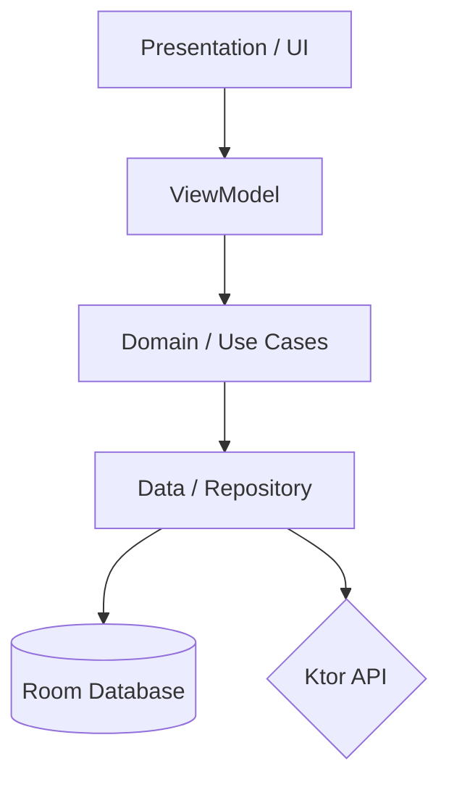

# 🏃‍♂️ Runique - Modern Fitness Tracker

**Runique** is a high-performance, production-ready fitness application designed to demonstrate senior-level Android engineering practices. It utilizes a **19-module** architecture, custom **Gradle Convention Plugins**, and a robust **Offline-First** strategy to provide a seamless, scalable tracking experience.

---

## 📖 Table of Contents
- [Architecture](#-architecture)
- [Module Structure](#-module-structure)
- [Build Logic & Convention Plugins](#-build-logic--convention-plugins)
- [Tech Stack](#-tech-stack)
- [Key Features](#-key-features)
- [Database & Offline Strategy](#-database--offline-strategy)
- [Dynamic Delivery](#-dynamic-delivery)
- [Design System](#-design-system)

---

## 🏗 Architecture

Runique follows **Clean Architecture** principles combined with **Unidirectional Data Flow (UDF)**. This ensures that the code is decoupled, testable, and maintainable.

### The 3 Layers:
1.  **Domain:** Contains Pure Kotlin business logic, Models, and Repository interfaces. No Android dependencies.
2.  **Data:** Implements Repositories, handling data fetching from Room (Local) and Ktor (Remote).
3.  **Presentation:** Jetpack Compose UI, ViewModels, and State management using the MVI/MVVM pattern.

---

## 📂 Module Structure

The project is highly modularized (19+ modules) to facilitate parallel development and faster build times.

| Module Group | Modules | Description |
| :--- | :--- | :--- |
| **App** | `:app` | Entry point, DI initialization, and navigation host. |
| **Auth** | `:auth:domain`, `:auth:data`, `:auth:presentation` | User registration, login, and secure session management. |
| **Run** | `:run:domain`, `:run:data`, `:run:presentation` | Core tracking logic, GPS integration, and map visualization. |
| **Analytics** | `:analytics:domain`, `:analytics:data`, `:analytics:presentation`, `:analytics:analytics_feature` | Dynamic feature for performance stats and custom charting. |
| **Core** | `:core:domain`, `:core:data`, `:core:database`, `:core:presentation:designsystem`, `:core:presentation:ui` | Shared logic, Design System, Local DB, and Network client. |
| **Build Logic** | `:build-logic:convention` | Custom Gradle plugins for project-wide standardization. |

---

## 🛠 Build Logic & Convention Plugins

Instead of repetitive `build.gradle.kts` files, Runique uses **Custom Convention Plugins** to enforce consistency:

- **`AndroidApplicationComposeConventionPlugin`**: Standardizes Compose setup, compiler flags, and dependencies for app modules.
- **`AndroidLibraryConventionPlugin`**: Configures common Android library settings.
- **`AndroidRoomConventionPlugin`**: Centralizes Room setup, KSP configurations, and schema exports.
- **`AndroidFeatureUiConventionPlugin`**: Automatically adds Compose, Design System, and UI dependencies to feature modules.
- **`AndroidDynamicFeatureConventionPlugin`**: Configures modules for on-demand delivery.

This approach reduces `build.gradle.kts` boilerplate by **over 70%**.

---

## 🚀 Tech Stack

- **UI:** [Jetpack Compose](https://developer.android.com/jetpack/compose) with [Material Design 3](https://m3.material.io/).
- **Navigation:** [Compose Navigation](https://developer.android.com/jetpack/compose/navigation) (Type-safe).
- **DI:** [Koin](https://insert-koin.io/) for lightweight, multi-module dependency injection.
- **Networking:** [Ktor Client](https://ktor.io/) with Content Negotiation (Kotlinx Serialization).
- **Database:** [Room](https://developer.android.com/training/data-storage/room) with **KSP** for local persistence.
- **Async:** Kotlin Coroutines & [Flow](https://kotlinlang.org/docs/flow.html) for reactive data streams.
- **Images:** [Coil](https://coil-kt.github.io/coil/) for asynchronous image loading.
- **Background:** [WorkManager](https://developer.android.com/topic/libraries/architecture/workmanager) for reliable data syncing.

---

## ✨ Key Features

### 📍 Precise Run Tracking
- **GPS & Sensor Fusion:** Real-time run tracking with fused location providers.
- **Interactive Maps:** Integration with mapping services to visualize running routes.
- **Foreground Services:** Reliable tracking that persists even when the app is in the background.

### 📊 Custom Data Visualization
- **Bespoke Line Chart:** A custom-built Compose component for visualizing pace, distance, and elevation over time.
- **Real-time Analytics:** Processing and displaying performance metrics on the fly.

### 🛡 Secure Authentication
- **Full Auth Flow:** Registration, login, and logout with rigorous validation.
- **Secure Persistence:** Using **EncryptedSharedPreferences** for token management.
- **Session Handling:** Automatic session refresh and secure navigation guards.

---

## 💾 Database & Offline Strategy

Runique follows a **Local Source of Truth** strategy to ensure a premium user experience regardless of connectivity.
1.  **Write Path:** UI sends data to the Repository -> Repository saves to **Room**.
2.  **Read Path:** UI observes a reactive **Flow** from the Room database.
3.  **Sync Path:** A background **WorkManager** job periodically synchronizes local data with the remote **Ktor** API.
4.  **Reliability:** In case of network failure, the user sees their data immediately; synchronization happens automatically when the connection returns.

---

## 📦 Dynamic Delivery

The `:analytics:analytics_feature` is configured as an **Android Dynamic Feature Module**. This allows:
- **Reduced App Size:** Users only download the analytics suite when they actually need it.
- **On-Demand Loading:** Demonstrates mastery of advanced Google Play Store delivery mechanisms.

---

## 🎨 Design System

Located in `:core:presentation:designsystem`, the app features a fully custom theme:
- **RuniqueTheme:** Custom colors, typography, and shapes tailored for a fitness app.
- **Reusable UI Components:** Standardized Buttons, TextFields, and Cards used across all modules to ensure visual consistency.
- **Adaptive Design:** UI that scales and adapts to different screen sizes and dark/light modes.

---

## 📸 Screenshots

<!-- 
TIP: To get GitHub-hosted URLs without adding images to your local project:
1. Open a 'New Issue' in your GitHub repo.
2. Drag and drop your screenshots into the comment box.
3. Copy the generated URLs (e.g., https://github.com/user/repo/assets/...)
4. Replace the 'PASTE_URL_HERE' placeholders below.
-->

| Login Screen | Run Overview | Analytics Dashboard |
| :---: | :---: | :---: |
|  |  |  |

---

## 📥 Installation & Setup

1.  Clone the repository: `git clone https://github.com/your-username/Runique.git`
2.  Open in **Android Studio (Ladybug or newer)**.
3.  Ensure you have **JDK 17** or higher configured.
4.  Sync Project with Gradle Files.
5.  Run the `:app` configuration.

---

*Built with a commitment to clean code, scalability, and the latest Android development standards.*
